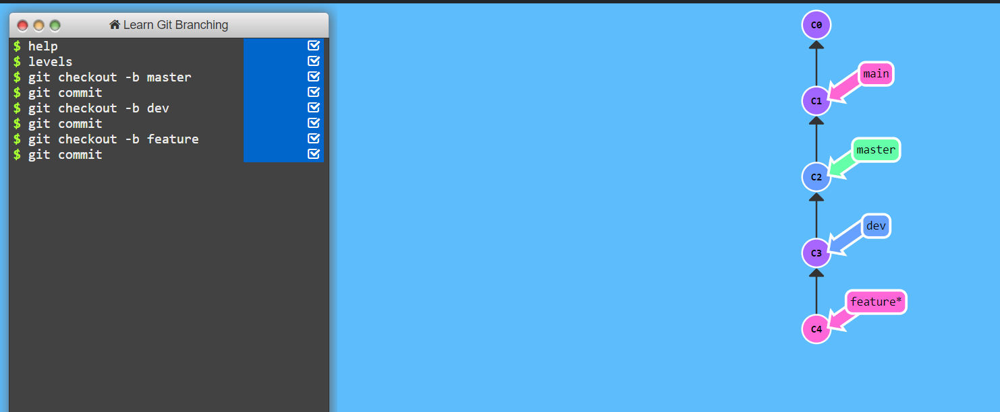
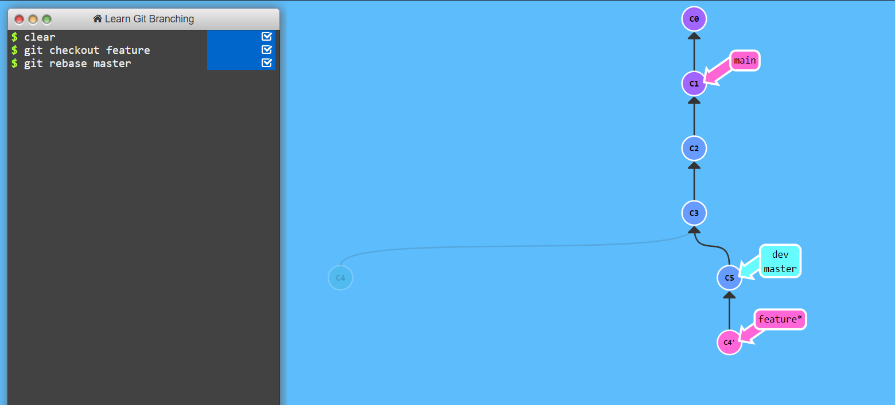
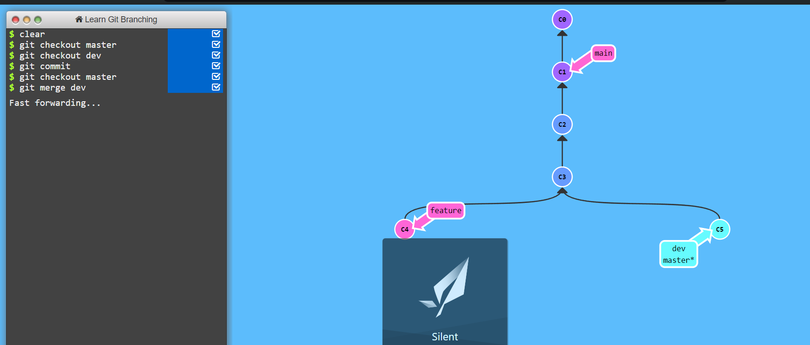

# Day 9: Advanced Git & GitHub for DevOps Engineers

## Daily Log

**Date:**
June 27, 2024

Today's focus was on advancing our understanding of Git and GitHub, with a specific emphasis on Git branching, reverting and resetting changes, and the concepts of Git rebase and merge. These advanced functionalities are essential for effective version control and collaborative software development.

## Key Concepts

### Git Branching

Git branching allows developers to isolate development work without affecting other branches in the repository. It enables the creation of features, bug fixes, or experimental changes in a contained area of the repository. Merging branches using pull requests facilitates integrating the changes into other branches.

### Git Revert and Reset

Git provides the
`git revert`
and
`git reset`
tools for removing or editing changes made in previous commits. These commands offer flexibility in managing historical changes in the codebase.

### Git Rebase and Merge

- **Git Rebase**
  : Integrates changes from one branch to another, modifying the commit logs upon completion. It addresses shortcomings of merging, particularly regarding commit logs.
- **Git Merge**
  : Allows developers to merge Git branches while maintaining the commit logs of the individual branches.

## Tasks

### Task 1: Git Branching and Revision Control

### Step 1: Create and switch to the dev branch

```sh
# Ensure you are on the master branch
git checkout master

# Create and switch to the dev branch
git checkout -b dev
Step 2: Add version01.txt with initial content and commit

# Navigate to the Devops/Git/ directory
cd Devops/Git/

# Create the file and add initial content
echo "This is first feature of our application" > version01.txt

# Stage and commit the changes
git add version01.txt
git commit -m "Added new feature"
Step 3: Push changes to remote repository

# Push the dev branch to the remote repository
git push origin dev
Step 4: Add more content and commit each change

# Add first line to the file and commit
echo "This is the bug fix in development branch" >> version01.txt
git add version01.txt
git commit -m "Added feature2 in development branch"

# Add second line to the file and commit
echo "This is gadbad code" >> version01.txt
git add version01.txt
git commit -m "Added feature3 in development branch"

# Add third line to the file and commit
echo "This feature will gadbad everything from now." >> version01.txt
git add version01.txt
git commit -m "Added feature4 in development branch"
Step 5: Restore the file to a previous version

# Use git log to find the commit hash for "Added feature2 in development branch"
git log

# Use git reset to revert the file to the specified commit
git reset --hard <commit-hash>

# Push the reverted changes to the remote repository
git push -f origin dev
```

##Task 2
Step 1: Create additional branches and make changes

```sh
# Ensure you are on the master branch
git checkout master

# Create and switch to a new branch called feature
git checkout -b feature

# Make some changes (for example, add a new file)
echo "Some new feature" > feature.txt
git add feature.txt
git commit -m "Added new feature in feature "

# Push the feature  to the remote repository
git push origin feature
Step 2: Merge dev branch into master

# Switch to the master branch
git checkout master

# Merge the dev branch into master
git merge dev

# Push the changes to the remote repository
git push origin master
Step 3: Rebase feature  onto master

# Switch to the feature
git checkout feature

# Rebase feature  onto master
git rebase master

# Push the rebased branch to the remote repository
git push -f origin feature
```

##Images for reference




## References

- [What Are the Best Git Branching Strategies](https://www.abtasty.com/blog/git-branching-strategies/) platform.
- [Git Branching Strategies for a DevOps Project](https://www.youtube.com/watch?v=NzjK9beT_CY)
- [Git Branching Workflow in Production](https://www.youtube.com/watch?v=7xhkEQS3dXw)
- [Github and GitLab Branching Strategy](https://www.youtube.com/watch?v=KKByv7JyzOw)

---

Happy Coding! 🚀

**Roshan Sahani**
